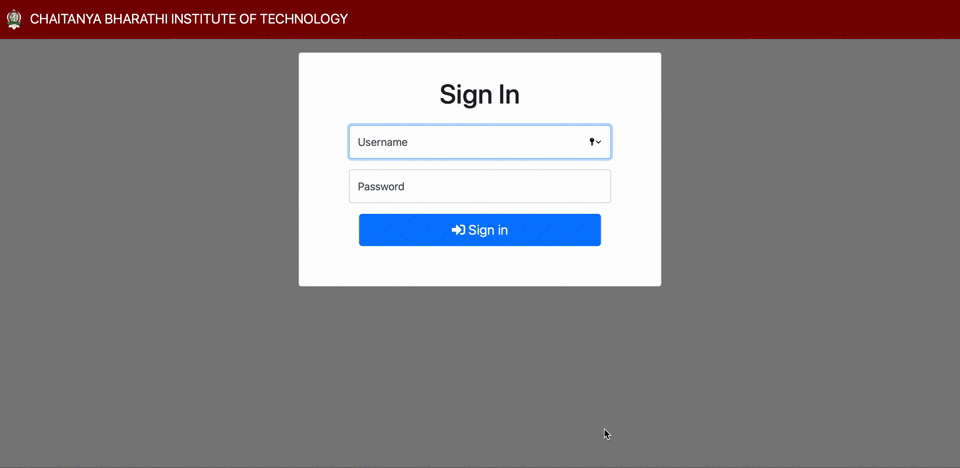

# Student Performance Analysis

Developed a website to automate student performance analysis based on various evaluation metrics, for the CS Dept. of CBIT. Used infographics (tables, graphs and charts) for better visualisation of performance comparison between classes of the same department, and that of the current batch with the previous ones. Curriculum and teaching methods revised and revamped based on the result analysis of previous batches.

