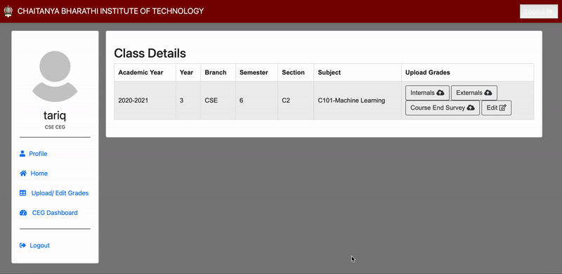
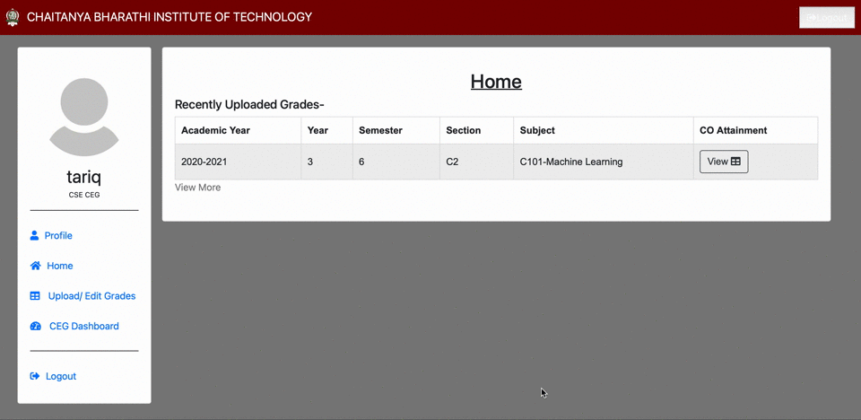

# Student Performance Analysis

Developed a website to automate student performance analysis based on various evaluation metrics, for the CS Dept. of CBIT. Used infographics (tables, graphs and charts) for better visualisation of performance comparison between classes of the same department, and that of the current batch with the previous ones. Curriculum and teaching methods revised and revamped based on the result analysis of previous batches.

Each faculty is provided access to only upload/edit the marks of their students, ie. the classes they're handling.  

## Main dashboard
<u>Profile</u> - Change email ID and password of user.
<u>Home page</u> - List of classes for which marks were uploaded. 
<u>Upload/Edit Grades</u> - List of classes assigned to the facutly. Provides link to add students grades.

## Add students marks

## Edit students marks

## View CO table

## CEG dashboard

