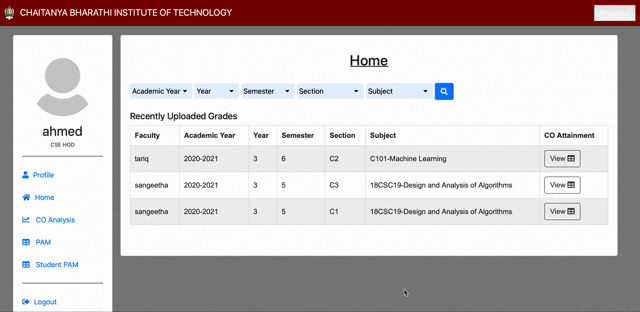

# Student Performance Analysis

Developed a website to automate student performance analysis based on various evaluation metrics, for the CS Dept. of CBIT. Used infographics (tables, graphs and charts) for better visualisation of performance comparison between classes of the same department, and that of the current batch with the previous ones. Curriculum and teaching methods revised and revamped based on the result analysis of previous batches.

## Main Dashboard
- Profile - Change email ID and password of user.
- Home page - List of classes for which marks were uploaded. 
- Upload/Edit Grades - List of classes assigned to the facutly. Provides link to add students grades.

Note: Each faculty is provided access to only upload/edit the marks of their students, ie. the classes they're handling.  

## Upload Marks
- Faculty can upload students mid terms, assignments, and final exam grades. 
- Since most faculty use excel sheets to note students marks, we provided a custom excel sheet template which they can use to directly upload storing marks (instead of manually adding it in the application). 
- There are two options for saving the data: `Save` and `Submit`
    - Save: The data will be saved and can be edited.
    - Submit: The data will be saved, but not editable. Generally used when faculty are given deadline to upload the finalized marks. 

## Edit Marks
- As stated previously, once a faculty uploads students marks and clicks `Submit`, they do not have permissions to make any more changes to those marks.
- The edit marks page is provided in case a faculty submits the marks, but later realizes an error in the uploaded marks. The difference here, however, is that they have to provide a reason for this change. The change and the reason is recorded, which can be later be viewed by the HOD or CEG (Course Examiner).      

## View CO Table
The main purpose of the website is to automate the student performance analysis (CO and PO).
- Table and graphs to display the course outcomes (CO) attained for a course by the particular class.
- The procedure to calculate CO is provided by the National Board of Accreditation, India. 

## CEG Dashboard
The Course Expert Group (CEG) or course coordinator can do the following:
- View the reason for change in students marks made by a faculty.
- Add the marks distrbution for internal and external exams.
- Upload question papers
- Add Program articulation matrix required for analysis calculation 
- View performance comparison graphs between classes.

## HOD Dashboard
The Head of Department (HOD) of a particular department can do the following:
- View all the CO tables and graphs of faculty in their department.
- Search option with various filters like academic year, class, section, course/subject, etc.

## View PO Table
- Displays the threshold (minimum) program outcomes (PO) which should be attained by a class batch in the courses.
- Calculates the actual PO attained by the entire class batch.
- Provides a comparison of the ideal and calculated PO value using graphs.

